# 📚 Book Store Management System 🌟

## 🌈 Overview
This project is a **Book Store Management System** built using **JavaFX** 📱 for the user interface and **Hibernate JPA** 🗄️ for database connectivity. It supports three main roles: **Admin** 👑, **Employee** 🧑‍💼 (sales staff, cashier, etc.), and **Customer** 🛒, each with distinct functionalities to manage bookstore operations efficiently.

## 🖼️ Entity Diagram
The following diagram illustrates the relationships between entities in the system, including Account, Employee, Customer, Product, Order, and more.

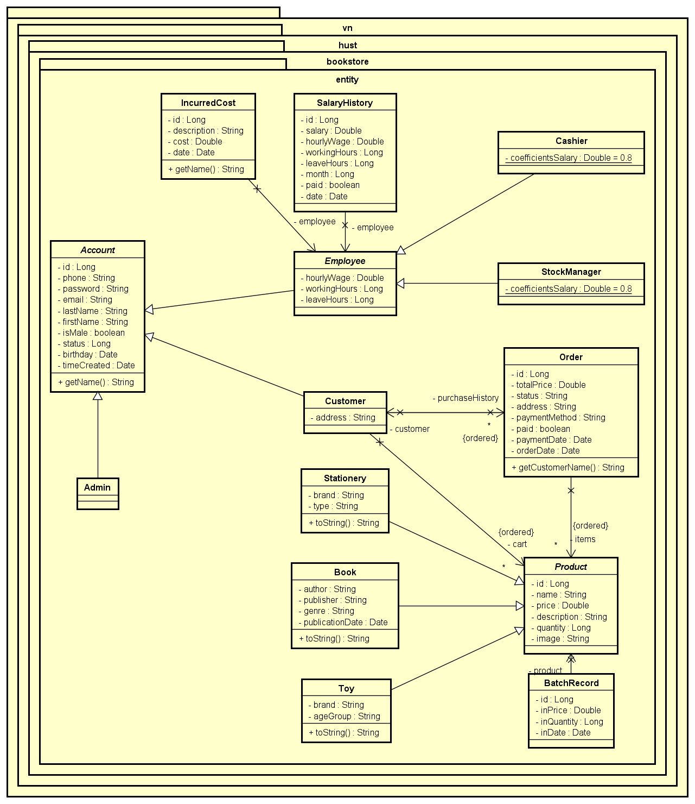

## ✨ Features

### 1. Admin Role 👑
- 🛠️ Manage employee accounts (create, update, delete).
- 📦 Oversee product inventory (books, toys, stationery).
- 💰 Track incurred costs and salary history of employees.
- 📊 View and manage batch records for stock updates.
- 📈 Access detailed reports on sales and stock levels.

#### Admin Functionalities Screenshot
Below is a screenshot of the Admin dashboard, showcasing the management interface for employees and inventory.

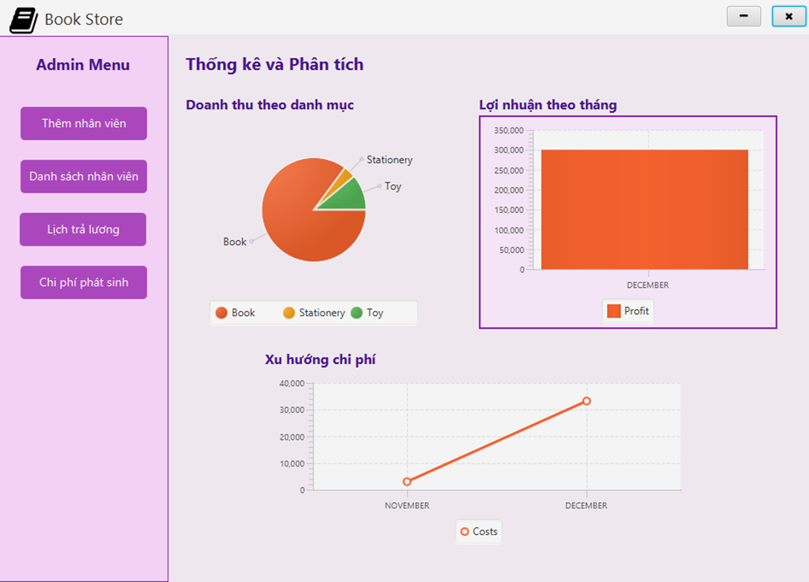

 
 

 
 

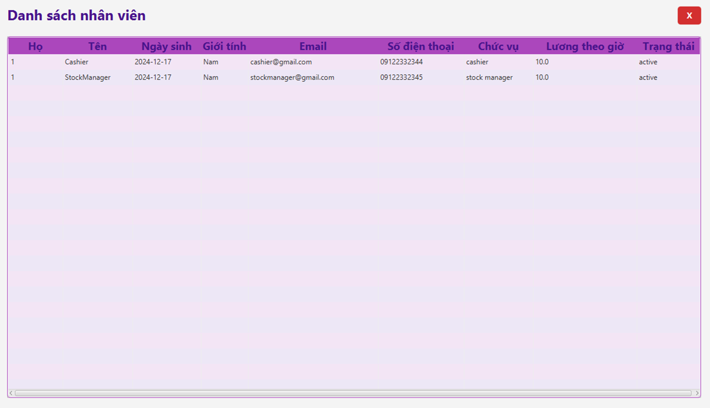

 
 

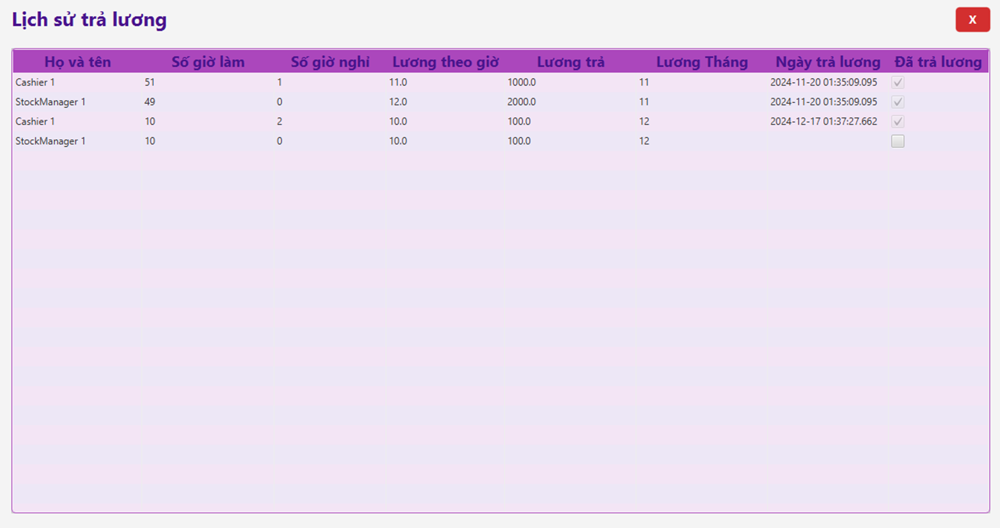

 
 

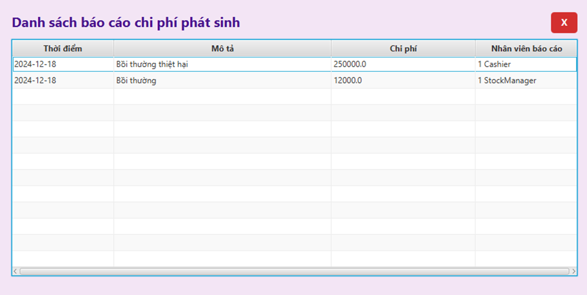

---

### 2. Employee Role 🧑‍💼
- **Sales Staff**: 🛍️ Manage customer orders, update cart, and process payments.
- **Cashier**: 💳 Handle transactions, record payment methods, and issue receipts.
- 📦 View and update stock levels for products (books, toys, stationery).
- ⏰ Track working hours and leave hours.

#### Employee Functionalities Screenshot
The following screenshot displays the Employee interface for handling sales and stock updates.

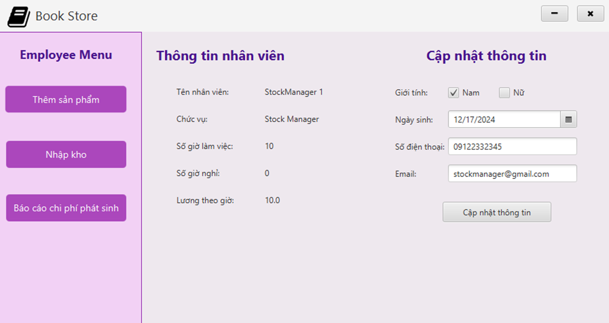

 
 

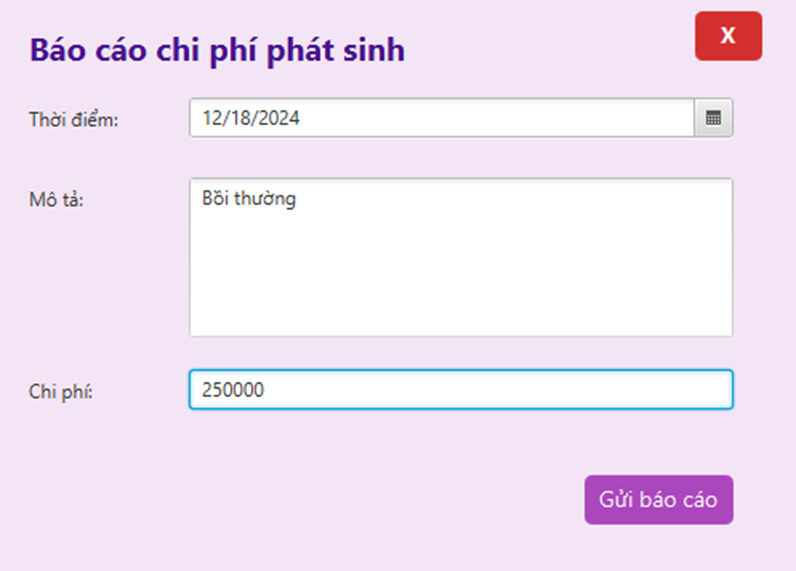

 
 

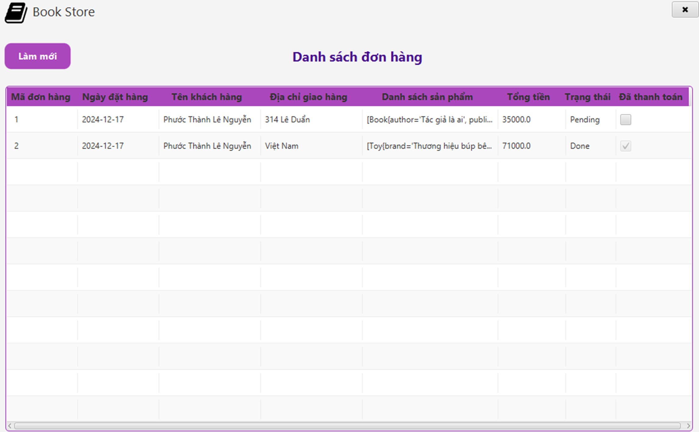

 
 

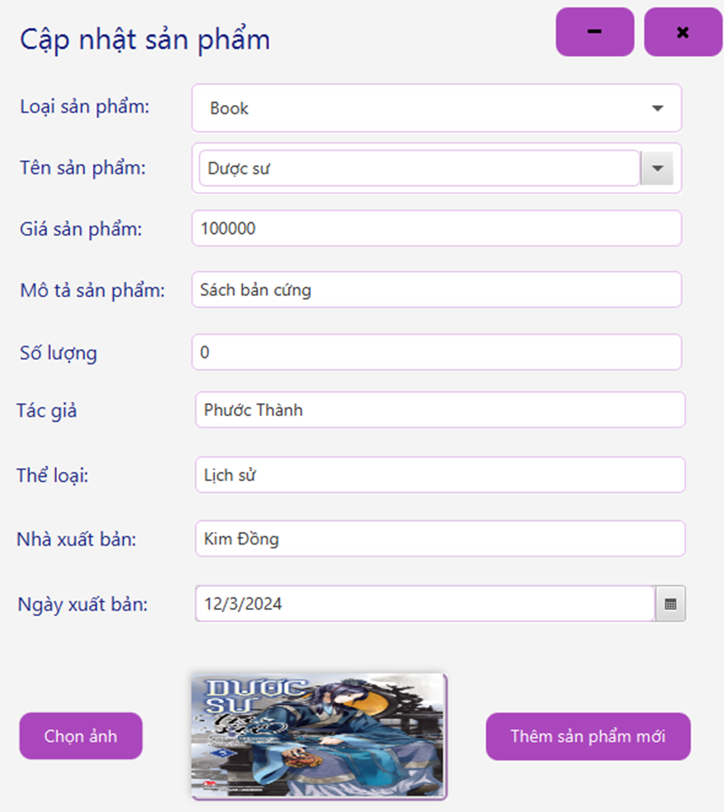

 
 

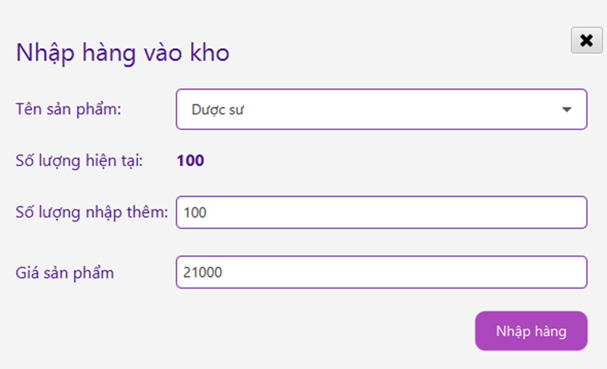

---

### 3. Customer Role 🛒
- 🔍 Browse and search for products (books, toys, stationery).
- 🛡️ Add items to cart and place orders.
- 📜 View purchase history and order status.
- 🖌️ Update personal information (address, contact details).

#### Customer Functionalities Screenshot
This screenshot shows the Customer interface for browsing products and managing orders.

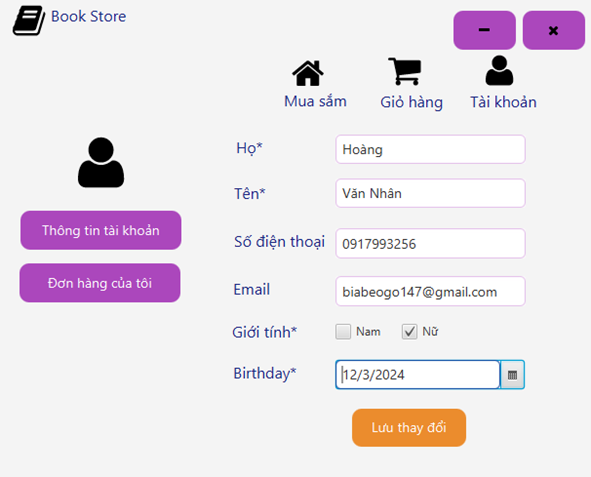

 
 

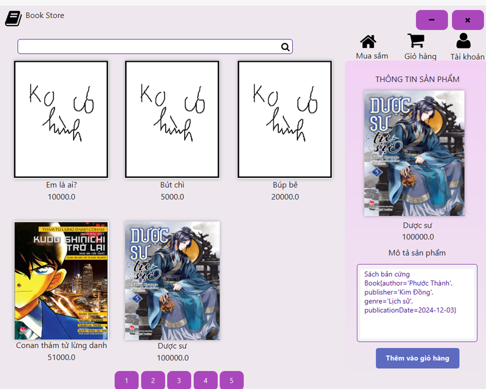

 
 

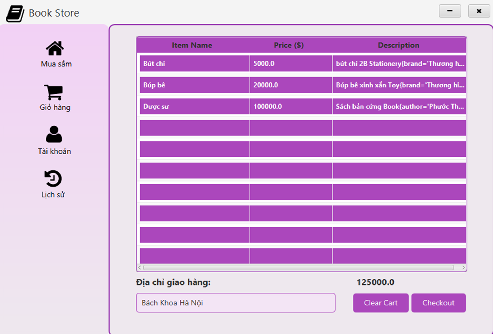

 
 

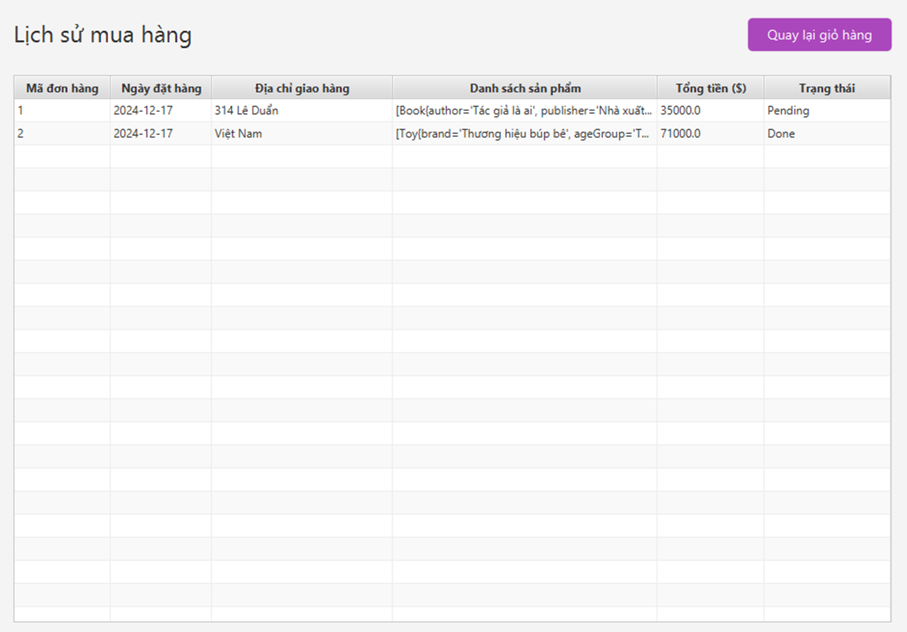

---

## 🛠️ Technical Details

### 🏗️ Architecture
- **Frontend**: JavaFX 📱 for a responsive and user-friendly interface.
- **Backend**: Hibernate JPA 🗄️ for ORM (Object-Relational Mapping) to interact with the database.
- **Database**: Relational database 📋 (schema includes entities like Account, Employee, Customer, Product, Order, etc.).

### 🔗 Entity Relationships
- **Account**: Base entity for Admin, Employee, and Customer with fields like phone, email, and password.
- **Employee**: Tracks salary history, working hours, and leave hours.
- **Customer**: Manages address, purchase history, and cart.
- **Product**: Includes subtypes (Book, Toy, Stationery) with specific attributes (e.g., author for Book, brand for Toy).
- **Order**: Links customers to products with details like total price and payment method.
- **IncurredCost** and **BatchRecord**: Used by Admin for financial and stock management.

### 📊 Coefficients
- Salary calculations for Employee and Cashier roles use a coefficient of **0.8** (as defined in the schema).

## ⚙️ Setup and Configuration
1. Ensure you have **Java 17+** installed ☕.
2. Configure Hibernate JPA with your database (update `persistence.xml` with your database credentials) 🗄️.
3. Import the project into your IDE (e.g., IntelliJ IDEA, Eclipse) 🖥️.
4. Run the JavaFX application using the main class (ensure JavaFX SDK is properly set up) 🚀.

## 🖥️ Usage
- **Admin** 👑: Log in with admin credentials to access the management dashboard.
- **Employee** 🧑‍💼: Use employee credentials to handle sales, cashier tasks, or stock updates.
- **Customer** 🛒: Register or log in to browse products, place orders, and view purchase history.

## 📝 Notes
- Ensure the database schema matches the entity relationships defined in the project 📋.
- Salary calculations for employees are based on the defined coefficient (0.8) 💰.
- The application supports basic CRUD operations for all entities 🛠️.